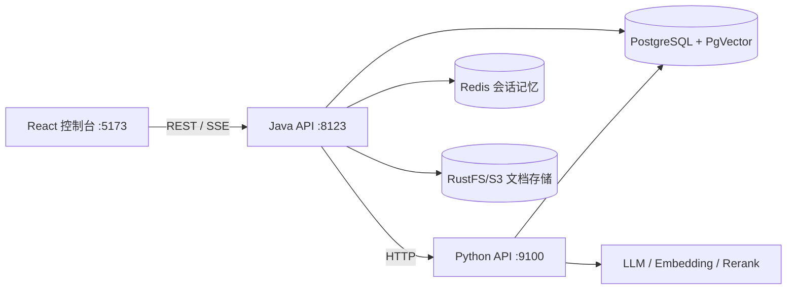

# Enterprise RAG Agent

企业级 RAG 智能问答平台：Java + Python 双后端，支持多格式文档入库、向量检索、意图识别、流式问答与工具调用。

> 个人项目 · 从 0 构建 · 已落地完整问答链路

## ✨ 核心特性

- **文档入库链路**：Apache Tika 解析 PDF / Word / Excel / Markdown，递归/段落/定长三种分块策略，批量 Embedding 写入 PgVector；三阶段流水线（PARSE → EMBED → COMPLETE）独立事务、失败断点重试、任务进度与步骤耗时实时监控
- **RAG 问答流水线**：9 阶段链路（问题独立化 → 意图路由 → 知识库选择 → 查询改写 → 混合检索 → 重排 → 上下文打包 → LLM 生成 → 引用校验），SSE 流式输出，多短路点降本
- **三路意图识别**：规则短路 + 向量语义匹配 + LLM 结构化分类，归一化加权融合，多轮追问按会话继承路由
- **多通道检索引擎**：多查询并行召回 + 向量/BM25 双路检索 + RRF 融合 + Cross-Encoder 精排，单路失败自动降级；配套检索调试控制台与 9 组消融实验测评（Hit@K / MRR / P95）
- **会话记忆**：Redis 工作记忆 + LLM 增量摘要压缩（双阈值触发、乐观锁防并发）
- **工具调用**：工具注册表 + LLM 参数提取 + AST 安全计算器
- **可观测性**：端到端 Trace 按查询理解/检索/生成/工具四阶段记录，入库指标（Micrometer）埋点
- **企业级底座**：租户隔离、JWT 鉴权、模型供应商/配置管理、Flyway 18 版数据库迁移

## 🏗️ 架构



## 🧱 技术栈

| 端 | 技术 |
|---|---|
| Java API | Spring Boot 3 / Java 17、MyBatis-Plus、Spring Security + JWT、Redis、Flyway、Apache Tika、AWS S3 SDK、Micrometer |
| Python API | FastAPI、LangChain（ChatOpenAI + LCEL）、Jieba、psycopg、pgvector |
| 前端 | React 18、TypeScript、Vite、Ant Design 5、Zustand、TanStack Query、ECharts |
| 存储 | PostgreSQL 16 + pgvector（HNSW）、Redis、RustFS（S3 协议） |

## 🚀 快速开始

### 1. 依赖

- JDK 17、Python 3.10+、Node.js 18+
- PostgreSQL 16（含 pgvector 扩展）、Redis、S3 兼容对象存储

### 2. 启动数据库

```bash
docker compose up -d postgres
```

### 3. 配置环境变量

```bash
cp .env.example .env          # Python API 配置
# JWT 密钥：生成 RSA 私钥/公钥并配置 JWT_PRIVATE_KEY_PATH / JWT_PUBLIC_KEY_PATH
```

### 4. 启动三个服务

```bash
# Java API（:8123）
mvn -pl java-api spring-boot:run

# Python API（:9100）
cd python-api
pip install -r requirements.txt
uvicorn app.main:app --host 0.0.0.0 --port 9100

# 前端（:5173）
cd frontend
npm install
npm run dev
```

访问 `http://127.0.0.1:5173`，健康检查：`http://127.0.0.1:8123/api/health`、`http://127.0.0.1:9100/health`。

## 📁 项目结构

```text
├── java-api/          # Spring Boot 业务服务
│   └── src/main/java/com/example/rag/
│       ├── auth/  user/  tenant/         # 鉴权与账号
│       ├── knowledge/  model/  embedding/ # 知识库/模型/向量
│       ├── ingestion/                     # 文档入库流水线
│       ├── retrieval/  evaluation/        # 检索与测评
│       ├── chat/  trace/                  # 问答与链路追踪
│       └── common/                        # 基础设施
├── python-api/        # FastAPI RAG 编排
│   └── app/
│       ├── api/  services/  schemas/      # 路由/业务/模型
│       ├── router/                        # 意图路由
│       ├── retriever/  rewriter/          # 检索与改写
│       ├── core/  assets/                 # 公共与静态数据
│       └── trace/  tools/  streaming/
├── frontend/          # React 控制台
└── docs/              # 设计文档与开发记录
```

## 📚 文档

- [系统总览与路线图](docs/system-overview-and-roadmap.md)
- [架构流程图](docs/architecture-flowcharts.md)
- [意图路由与知识库设计](docs/intent-routing-and-kb-domain-design.md)
- [前端后端集成分析](docs/frontend-backend-integration-analysis.md)
- `docs/step-*.md`：从 0 到 1 的分步开发记录（Java 工程 → 入库 → 检索 → 问答 → 可观测）

## 🗺️ Roadmap

- [ ] Prometheus + Grafana 指标采集与告警
- [ ] 跨服务 OpenTelemetry 链路追踪
- [ ] MCP 工具协议接入
- [ ] Milvus 向量库迁移评估
- [ ] 多租户资源配额与限流
