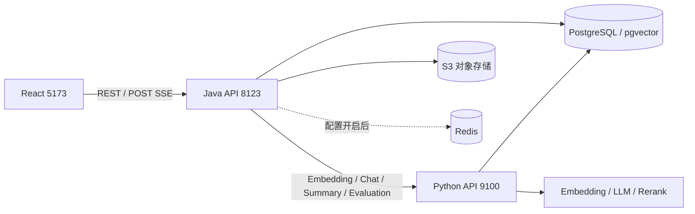

# 架构与模块

[返回目录](README.md)

## 系统定位

业务主线是「按租户管理知识 → 上传并索引文档 → 提问 → 返回带引用的回答 → 观察效果」。模型管理属于平台能力，检索调试与异步测评属于研发管理能力。

浏览器正常访问 Java。Python 入口没有与 Java 等价的 JWT 校验，应部署为内部服务。两端共享数据库，不是独立的数据域。

## 技术栈与构建

| 工程 | 入口 | 技术 |
| --- | --- | --- |
| Maven 父工程 | `pom.xml` | 仅聚合 java-api，Java 17、Spring Boot 3.3.7 |
| Java | RagApiApplication | Spring MVC/Security、MyBatis-Plus 3.5.7、Flyway、Tika 2.9.2、S3 SDK、Redis、Micrometer |
| Python | app/main.py | FastAPI 0.115.6、Pydantic 2.10.4、LangChain、psycopg、jieba；新增 SQLAlchemy/redis 依赖 |
| 前端 | src/main.tsx | React 18、TypeScript 5.6、Vite 6、Ant Design 5、Zustand 5、React Query、ECharts |
| 基础设施 | docker-compose.yml | 仅 PostgreSQL 16 + pgvector |

版本以依赖文件为准。Python 部分依赖没有锁定版本；Dockerfile 使用 Python 3.12。源码中提到 LangGraph 不表示实际引入图式工作流。

## Java 模块

| 包 | 职责 | 协作 |
| --- | --- | --- |
| auth | 登录、刷新、密码、退出、JWT | 用户表、刷新令牌表、Security |
| tenant / user | 租户与账号管理 | 当前用户、租户权限 |
| knowledge | 知识库、配置、上传、文档管理 | S3、任务登记、Chunk |
| ingestion | 异步流水线、任务、步骤、解析、切分、重试 | Tika、Embedding、数据库 |
| embedding | Python HTTP 调用和向量批次保存 | Chunk、任务 |
| chat | 会话、消息、同步/流式问答、现有记忆与摘要 | Python、Redis、Trace |
| evaluation | 检索调试与测评网关 | Python 调试/测评 |
| model | 供应商、模型配置和可用模型查询 | 模型相关表 |
| trace | Trace 保存、查询、统计 | Java 问答与 Python 节点 |
| common | 响应、异常、ID、上下文、数据库与存储设施 | 全部业务 |

当前没有独立 Java retrieval 包，检索网关位于 evaluation。

## Python 模块

| 目录 | 职责 |
| --- | --- |
| api | HTTP 路由、依赖、错误和响应 |
| apps/chat | 请求转换、SSE 调度、响应、摘要 |
| apps/evaluation | 检索调试、进程内评测作业、数据集准备 |
| rag/engine.py | RAG 统一入口与编排 |
| rag/router | 规则/向量/LLM 意图融合、知识库选择 |
| rag/rewriter | 多轮独立化、检索问题改写 |
| rag/retriever | 向量/关键词、多查询、RRF、重排 |
| rag/context / postprocess | 上下文预算、回答引用校验 |
| rag/clients / llm | 模型适配、客户端工厂 |
| rag/db / trace / tools | 数据库池、执行记录、工具 |
| schemas / rag/schemas | HTTP 契约与内部数据模型 |
| memory | 正在建设的 Python 会话存储，未接入主链路 |
| streaming / assets | SSE 编码、同义词、意图样例 |

`rag/workflow/__init__.py` 是预留入口。当前真正执行编排的是 RagEngine 的普通方法。

## 对象和 ID

tenantId 是隔离边界，userId 是操作主体。knowledgeBaseId 确定内容集合与入库配置；documentId 关联原始文件；Chunk 是召回和引用单元。taskId 标识入库，stepCode 标识步骤；conversationId 标识会话，traceId 标识问答追踪，requestId 关联 HTTP 日志，runId 标识测评作业。持有 ID 不表示获得访问权限。

## 一致性边界

Java 事务不能覆盖 S3 和外部模型：上传采用失败清理，入库采用分阶段保存和恢复。异步事件及评测作业都在进程内，没有消息中间件的持久投递保证。Java 仍承担聊天写入，Python 化处于迁移中，不能按目标架构上线。

源码：[Java 启动类](../../java-api/src/main/java/com/example/rag/RagApiApplication.java)、[Python 入口](../../python-api/app/main.py)、[前端路由](../../frontend/src/router/AppRouter.tsx)。
