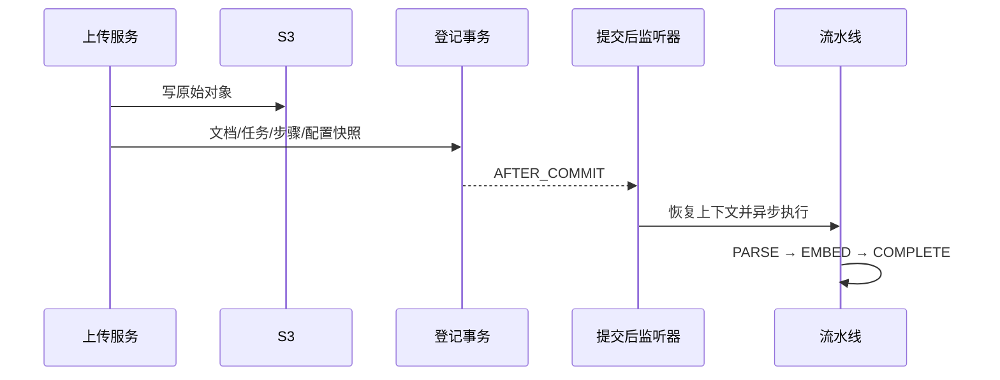

# 文档上传与入库

[返回目录](README.md)

## 上传与幂等

`POST /api/documents/upload` 使用 multipart：knowledgeBaseId 必填，文件字段为 file，可重复；metadata 为可选字符串。返回文档列表。限制单文件 100MB、请求 120MB。

上传逐文件执行：校验文件和知识库 → 清理文件名 → 读取字节 → SHA-256 → 查询有效重复 → 上传 S3 → 短事务登记文档、任务、步骤、配置。相同租户/知识库的相同内容返回已有文档，部分唯一索引防并发重复。登记失败尽力清理新对象。

批量上传不是整个批次原子提交；前面成功的文件不会因后面失败自动回滚。完整字节读取也带来并发大文件内存压力。



## 执行和状态

IngestionTaskStartListener 使用 AFTER_COMMIT、fallbackExecution=true。监听器恢复用户、requestId、taskId、tenantId，finally 清理。线程池核心 2、最大 4、队列 50、CallerRunsPolicy；拥塞时发布线程可能承担任务。

| 流水线阶段 | 主要工作 | 结果 |
| --- | --- | --- |
| PARSE | 下载、Tika、清理、切分、保存 Chunk | 解析完成，进度到 30 |
| EMBED | 批次调用模型、校验、写向量 | 向量及模型/维度标记 |
| COMPLETE | 汇总状态 | 文档 READY，任务 SUCCESS |

数据库细粒度步骤为 UPLOAD_DOCUMENT、PARSE_DOCUMENT、SPLIT_CHUNK、SAVE_CHUNK、EMBEDDING、INDEX_VECTOR。它们与流水线 StepCode 不同。

任务枚举：PENDING/RUNNING/SUCCESS/FAILED/CANCELED；文档枚举：PENDING/PROCESSING/PARSED/EMBEDDING/READY/FAILED。枚举存在 CANCELED 不代表公开了取消 API。

## 切分配置

```json
{
  "chunkType": "recursive",
  "chunkSize": 800,
  "chunkOverlap": 100,
  "embeddingModel": "<实际模型名>",
  "embeddingDimension": 1536,
  "embeddingBatchSize": 10
}
```

recursive 是默认分层切分，paragraph 按段落组织，fixed 使用定长窗口。chunkSize/Overlap 单位为字符，不是 Token。配置来自知识库 chunk_strategy，登记为任务 pipeline_config 快照，上传不单独覆盖。

解析由 DocumentIngestionProcessor、TikaDocumentParser、TextNormalizer 和 TextChunkerFactory 协作。当前没有接入 OCR/视觉版面理解，扫描 PDF、图片和复杂表格不能保证有效解析。

注意 `ingestion/config/PipelineConfig` 是参数 DTO，`ingestion/pipeline/PipelineConfig` 是线程池配置，导入时不可混淆。

## 向量与事务

Python Embedding 返回 model、dimension、items；每项含 index 和 embedding。Java 通过 ChunkEmbeddingServiceImpl 与 EmbeddingBatchPersistenceService 校验和保存。解析、任务更新、向量批次不是全链路一个事务，部分成功后失败需要恢复。

Python Embedding HTTP Schema 当前只有 texts/model，没有 dimension；Java 配置存在维度字段不等于它已跨 HTTP 传递。模型输出、Python 默认、Java 校验、数据库 vector(1536) 必须一致。

## 重试

只有 FAILED 可重试。读取首个失败步骤：上传/解析/切分/保存回到 PARSE，Embedding/索引回到 EMBED，找不到失败步骤默认 PARSE。重置后续步骤与错误，再发事件；EMBED 重试初始进度 30，PARSE 为 0。

排查顺序：task error → stepCode → 原对象可读 → Chunk 完整性 → 模型与维度 → 限流/超时。不要手改 READY 代替索引。进程内事件不提供持久消息确认，崩溃可能留下 PENDING/RUNNING，不能假定已有自动补偿扫描器。

源码：[上传服务](../../java-api/src/main/java/com/example/rag/knowledge/service/impl/KnowledgeDocumentServiceImpl.java)、[流水线](../../java-api/src/main/java/com/example/rag/ingestion/pipeline/IngestionPipeline.java)、[重试](../../java-api/src/main/java/com/example/rag/ingestion/service/IngestionTaskRetryService.java)。
