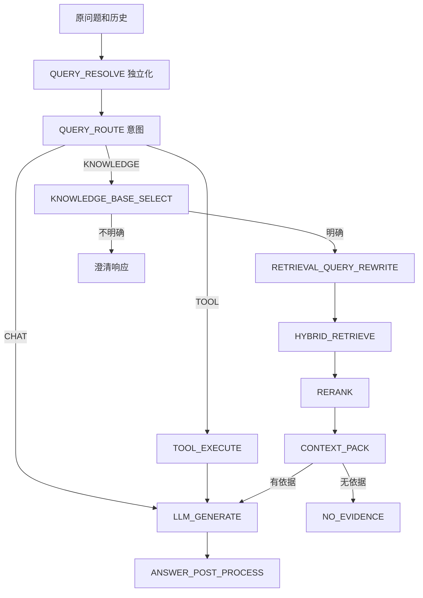

# Python 与 RAG 开发

[返回目录](README.md)

## 入口与依赖

`create_app()` 注册 health、embeddings、chat、retrieval、evaluation、conversations/summary 路由；lifespan 初始化并关闭 psycopg 连接池。API 层负责 HTTP，apps 层负责业务，rag 层负责算法能力。部分核心模块仍引用 app.config 和顶层 schemas，因此不能把 rag 目录直接当成已经独立发布的包。

RagEngine 对外提供 query、prepare、generate_chunks/generate、embed、rewrite、retrieve、rerank、route_intent、select_knowledge_base、pack_context、postprocess_answer。RagQuery 携带问题、history、summary、tenant/user/knowledgeBase、model、last_route、tool_enabled；RagPrepared 保存生成前上下文，RagResult 保存最终结果。

## 完整问答流程

问题独立化与检索改写是两个阶段：前者让追问脱离上下文也可理解；后者产生语义查询、关键词、同义词和替代查询。不要将最终回答的问题原文替换成某个召回子问题。

## 意图与知识库选择

IntentRouter 先执行 QueryRouter 规则，非 fallback 直接采用；否则在线程池并行执行向量和 LLM 分类，经 fusion 归一化加权，支持单路失败。L0 包含 CHAT、KNOWLEDGE、TOOL、CLARIFY；L1 包含 EXPENSE、HR、CONTRACT、POLICY、GENERAL。

独立化标记 rewritten 且 last_route 非 CLARIFY 时，Engine 可继承上一轮路由。该能力依赖上层实际传入 last_route，当前聊天 Schema 迁移破坏了这一前提。

KnowledgeBaseSelector 根据租户/用户、显式知识库、domain 和候选情况选择；不明确时返回候选并要求澄清。显式选库不意味着跳过资源校验。意图样例在 assets/intent_examples.json，同义词在 assets/synonyms.json。

## 检索链路

1. PgVectorRetriever 按知识库读取 chunk_strategy 的 embeddingModel/embeddingDimension，生成查询向量。
2. SQL 使用余弦距离 `<=>` 排序，相似度为 `1-distance`，过滤 tenantId、deleted、文档删除状态；指定库时增加库、模型、维度条件。
3. KeywordRetriever 对正文和文件名做 ILIKE 包含匹配，借助 pg_trgm 索引；正文每个关键词命中加 1，文件名命中加 2。
4. 关键词去空去重，忽略长度小于 2 的词，最多 6 个，并转义 LIKE 特殊字符。
5. 多查询分支并行召回，按 Chunk/可配置内容哈希去重，RRF 融合排名；配置权重调整来源贡献。
6. RerankService 对候选精排；ContextPacker 在字符预算内打包并赋引用序号。

关键词检索不是 BM25。向量相似度、关键词分数、RRF 分数和 Rerank 分数含义不同，不能直接按数值大小跨列比较。

RRF 的基本贡献是来源权重除以 `rrf_k + rank`，聚合同一候选的来源排名；它避免直接相加不同量纲的原始分数。检索返回不足时先看过滤、模型维度和候选数量，再考虑增加 topK。

未指定知识库时，底层检索器允许全租户召回；向量检索使用全局模型/维度，此模式必须避免跨不同向量空间。`RagEngine.retrieve` 当前 final_top_k 参数未传入内部召回，不能假定它生效。

## 上下文、生成与引用

ContextPacker 按总字符与单文档字符预算截断，保留 citation_index 和截断标记。引用来自实际进入上下文的 Chunk，包含文档/Chunk ID、名称、内容、来源和各阶段分数。

无检索依据直接返回配置提示并跳过模型；知识库不明确也短路。普通聊天或工具结果进入 LlmClient，生成后 AnswerPostProcessor 校验引用序号，输出 answerStatus 与有效/无效序号。流式 delta 是未最终校验的草稿，最终应以 final 为准。

## 模型适配与工具

EmbeddingClient 使用 OpenAIEmbeddings，按 model/dimension 缓存客户端并校验向量数量/维度；provider 的默认 mock 字符串并未对应 Mock 分支。LLM 创建入口在 rag/llm/chat_model_factory.py，调用入口在 clients/llm_client.py；备用模型配置不代表所有模型端点都已实测。

工具注册表接口为 register/is_registered/execute，函数接受 dict 返回文本。目前内置 calculator，用 AST 和运算符白名单计算。Schema 中示例 web_search 不是已注册工具。未开通或执行异常进入澄清；工具返回的文本再作为模型上下文。

新增工具需定义明确输入、验证和错误语义，再注册并验证路由；计算器虽然不执行任意 Python，仍不能据此承诺有计算资源上限。

## 错误与复用

RagError 子类经 API 映射：InvalidQueryError 为 400，配置错误为 500，Embedding/LLM/Retrieval/Intent 错误为 502。Pydantic 校验通常为 422，HTTPException 可能返回 detail，不能假定所有 Python 错误都与 Java 外层完全相同。

新增业务可复用 Engine 的准备/检索/生成能力，但 with_memory 目前只保存属性，未在 query/prepare 中调用 load；with_trace 可提供记录器。不要把预留接口当成功能已经接通。

源码：[Engine](../../python-api/app/rag/engine.py)、[关键词召回](../../python-api/app/rag/retriever/keyword_retriever.py)、[向量召回](../../python-api/app/rag/retriever/pgvector_retriever.py)、[意图入口](../../python-api/app/rag/router/intent_router.py)。
