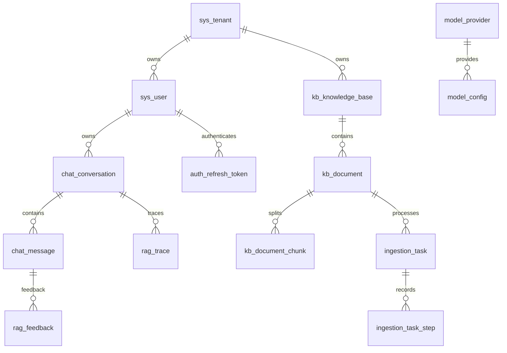

# 数据库与存储

[返回目录](README.md)

## 表关系

图表示业务关联；具体外键、可空性与删除策略以 SQL 为准。字段级基线和全部增量结构见 [数据参考](15-data-reference.md)。

## 表用途与读写方

| 表 | 用途 | 主要读写 |
| --- | --- | --- |
| sys_tenant / sys_user | 身份、角色、令牌版本 | Java |
| auth_refresh_token | 刷新令牌生命周期 | Java auth |
| kb_knowledge_base | 知识容器、domain、配置、文档计数 | Java 写，Python 选库读取 |
| kb_document | 文件元数据和处理状态 | Java 写，Python 检索关联 |
| kb_document_chunk | 文本、metadata、模型、维度、向量 | Java 入库写，Python 召回读 |
| ingestion_task / ingestion_task_step | 入库状态、耗时、失败点、配置快照 | Java |
| chat_conversation / chat_message | 历史、摘要、路由与消息 | 当前 Java 主链路写；Python 迁移未完成 |
| model_provider / model_config | 供应商与模型元数据 | Java |
| rag_trace | 执行节点、Token、耗时和失败 | Java 保存 Python 结果 |
| rag_feedback | 反馈表预留 | 未找到完整反馈业务 API |

## 数据约束

业务实体广泛采用 BIGINT ID、tenant_id、created_at/updated_at、deleted。MyBatis 配置逻辑删除值 true/false；Python 原生 SQL 显式过滤。不能把软删除当作物理清除，也不能仅靠前端筛选实现租户隔离。

JSONB 保存 chunk_strategy、pipeline_config、metadata、last_route、Trace 等结构。改字段时需要同时更新 Java TypeHandler/DTO、Python Schema 与前端类型。任务配置是登记时快照，知识库配置是后续任务默认值。

有效文档内容哈希唯一索引实现重复上传约束，Chunk 的文档内序号约束影响重建策略。V9 的 document_count 是冗余计数，修改/导入文档时需核对服务是否同步维护。

## 向量和关键词

V1 创建 vector(1536) 与 HNSW cosine 索引；V15 增加 embedding_dimension 标记，没有把向量列改为任意维度。知识库 JSON 能填写某维度，不代表数据库支持该维度。

V2 增加 pg_trgm 与 GIN 文本检索索引，运行时是 ILIKE 关键词命中，不是 PostgreSQL 全文 ts_rank 或 BM25。检查性能时用 EXPLAIN 分析真实 SQL 和过滤条件，不能只看到索引存在就假定一定被使用。

## Flyway 演进

| 版本 | 变化 |
| --- | --- |
| V1 | 基础表、扩展、索引与时间触发器 |
| V2 | 关键词检索索引 |
| V3_auth | 认证字段，但命名不符合默认双下划线规则 |
| V4 / V6 | 刷新令牌表 / 补齐认证字段 |
| V5 | Trace Token、降级、时间字段 |
| V7 / V8 | stepCode、任务查询索引 |
| V9 / V10 | 文档计数、有效内容去重 |
| V11 / V13 / V14 | 管理员、平台与模型种子数据 |
| V12 | 任务配置快照 |
| V15 / V16 | Chunk 维度、知识库 domain |
| V17 / V18 | 会话摘要及上一轮路由 |
| V19 | 会话/消息 ID 序列默认值、运行中 Trace 索引 |

磁盘有 19 个版本文件不等于数据库已成功执行 19 次迁移，需查询 flyway_schema_history。V3 的默认命名规则问题由 V6 补齐字段，但仍应查实际历史。不要修改已应用 SQL 的校验内容来修复新问题，应增加前向迁移。

V19 使用 ACCESS EXCLUSIVE 锁，序列从当前最大 ID 后开始；若 Java 仍显式写 Snowflake、Python 使用序列，必须先完成写入所有权切换。仅序列初始化不解决长期混写问题。它没有创建 chat_turn。

## Redis 与对象存储

Redis 是 Java 可选记忆缓存，不是最终历史来源；TTL 1 天，重启/过期需回退数据库。当前 YAML 前缀不匹配导致 enabled 不应按注释判断。

S3 保存原始文件，数据库保存 URI 与业务关联。数据库备份不包含原文件，对象备份不包含租户/文档关系；恢复需保持二者一致。上传失败补偿是尽力执行，应按对象与记录关联清理孤立文件，不能盲删 bucket。

源码：[迁移目录](../../java-api/src/main/resources/db/migration)、[向量查询](../../python-api/app/rag/retriever/pgvector_retriever.py)、[对象存储](../../java-api/src/main/java/com/example/rag/common/storage/S3ObjectStorageServiceImpl.java)。
