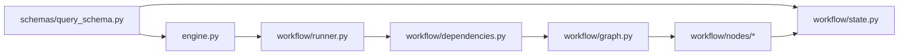
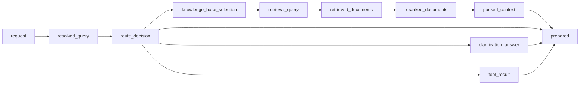
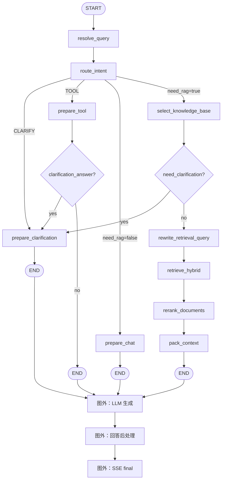

# Step 32：LangGraph RAG 工作流

## 1. 目标与边界

LangGraph 只接管 LLM 生成前的 RAG 编排：

```text
问题独立化
  -> 意图路由
  -> 普通对话 / 工具 / 澄清 / 知识库
  -> 知识库选择
  -> 检索查询改写
  -> 混合检索
  -> 重排
  -> 上下文打包
  -> RagPrepared
```

LLM 生成、回答后处理和 SSE 输出仍由现有 `RagEngine.generate_chunks()`、
`AnswerPostProcessor` 和 `ChatService` 完成。这样可以先验证图编排，同时保持
`delta -> final -> done` 协议不变。

默认使用 legacy 编排：

```env
RAG_ORCHESTRATOR=legacy
```

启用 LangGraph：

```env
RAG_ORCHESTRATOR=graph
```

## 2. 目录结构

```text
app/rag/
├── engine.py
├── settings.py
├── schemas/
│   └── query_schema.py           # RagQuery / RagPrepared / RagResult
└── workflow/
    ├── state.py                  # RagState
    ├── dependencies.py           # 节点依赖接口
    ├── routing.py                # 条件边函数
    ├── graph.py                  # StateGraph 组装
    ├── runner.py                 # RagWorkflow
    └── nodes/
        ├── common.py             # 公共节点辅助函数
        ├── query.py              # 查询和分支准备节点
        ├── retrieval.py          # 检索链路节点
        └── tool.py               # 工具链路节点
```

职责划分：

- `engine.py` 只负责公开入口和能力选择。
- `schemas/query_schema.py` 是共享契约。
- `dependencies.py` 是工作流与底层 RAG 能力之间的 seam。
- `nodes/` 按业务阶段拆分。
- `routing.py` 只负责条件选择。

## 3. 依赖方向



节点不直接访问 `engine._query_resolver`、`engine._retriever` 等私有属性。
`RagWorkflow.from_engine()` 在边界处把这些能力适配为三组依赖：

```python
@dataclass(frozen=True)
class RoutingDependencies:
    settings: RagSettings
    trace_node: TraceNode
    resolve_query: ResolveQuery
    route_intent: RouteIntent
    skip_retrieval_stage: SkipRetrieval


@dataclass(frozen=True)
class RetrievalDependencies:
    settings: RagSettings
    trace_node: TraceNode
    select_knowledge_base: SelectKnowledgeBase
    rewrite_retrieval_query: RewriteRetrievalQuery
    retrieve_documents: RetrieveDocuments
    rerank_documents: RerankDocuments
    pack_documents: PackDocuments
    build_citations: BuildCitations
    build_clarification_answer: BuildClarification


@dataclass(frozen=True)
class ToolDependencies:
    settings: RagSettings
    trace_node: TraceNode
    is_tool_registered: IsToolRegistered
    execute_tool: ExecuteTool
```

生产环境连接真实 `RagEngine` 能力，测试使用内存 fake callables。

## 4. 状态 `RagState`

`RagState` 使用 `TypedDict` 和 `NotRequired`。`request` 是唯一必填字段。

| 字段 | 类型 | 产生节点 | 主要消费者 |
| --- | --- | --- | --- |
| `request` | `RagQuery` | 初始输入 | 所有节点 |
| `resolved_query` | `ResolvedQuery` | `resolve_query` | `route_intent`、检索节点 |
| `route_decision` | `RouteDecision` | `route_intent` | 条件边、结果组装 |
| `knowledge_base_selection` | `KnowledgeBaseSelection` | `select_knowledge_base` | 检索和打包 |
| `retrieval_query` | `RetrievalQuery` | `rewrite_retrieval_query` | `retrieve_hybrid` |
| `retrieved_documents` | `list[Document]` | `retrieve_hybrid` | 重排和打包 |
| `reranked_documents` | `list[Document]` | `rerank_documents` | `pack_context` |
| `packed_context` | `PackedContext` | `pack_context` | 结果组装 |
| `prepared` | `RagPrepared` | 所有终止节点 | `RagWorkflow.prepare()` |
| `clarification_answer` | `str` | 澄清、知识库选择、工具 | `prepare_clarification` |
| `tool_result` | `str` | `prepare_tool` | `RagPrepared.tool_result` |



## 5. 节点

| 节点 ID | 节点工厂 | 读取状态 | 写入状态 | 底层能力 |
| --- | --- | --- | --- | --- |
| `resolve_query` | `make_resolve_query_node` | `request` | `resolved_query` | `ConversationQueryResolver` |
| `route_intent` | `make_route_intent_node` | `request`、`resolved_query` | `route_decision` | `RagEngine._resolve_route()` |
| `prepare_chat` | `make_prepare_chat_node` | `request`、`route_decision` | `prepared` | 跳过检索 |
| `prepare_clarification` | `make_prepare_clarification_node` | `request`、`route_decision`、`clarification_answer` | `prepared` | 跳过检索和生成 |
| `prepare_tool` | `make_prepare_tool_node` | `request`、`route_decision` | `tool_result`、`prepared` 或 `clarification_answer` | 工具注册表与执行器 |
| `select_knowledge_base` | `make_select_knowledge_base_node` | `request`、`resolved_query`、`route_decision` | `knowledge_base_selection` | `KnowledgeBaseSelector` |
| `rewrite_retrieval_query` | `make_rewrite_retrieval_query_node` | `resolved_query` | `retrieval_query` | `RetrievalQueryRewriter` |
| `retrieve_hybrid` | `make_retrieve_hybrid_node` | 请求、知识库和检索查询 | `retrieved_documents` | `HybridRetriever` |
| `rerank_documents` | `make_rerank_documents_node` | 查询和候选文档 | `reranked_documents` | `RerankService` |
| `pack_context` | `make_pack_context_node` | 检索结果和路由 | `packed_context`、`prepared` | `ContextPacker` |

## 6. 条件边

| 来源 | 条件函数 | 目标 |
| --- | --- | --- |
| `route_intent` | `choose_route` | 普通对话、澄清、工具或知识库 |
| `select_knowledge_base` | `choose_knowledge_base` | 改写查询或澄清 |
| `prepare_tool` | `choose_after_tool` | 澄清或结束 |

```python
def choose_route(state: RagState) -> str:
    route_decision = state["route_decision"]
    if route_decision.intent == L0Intent.CLARIFY:
        return "clarification"
    if route_decision.intent == L0Intent.TOOL:
        return "tool"
    if route_decision.need_rag:
        return "retrieval"
    return "chat"
```

```python
def choose_knowledge_base(state: RagState) -> str:
    if state["knowledge_base_selection"].need_clarification:
        return "clarification"
    return "retrieval"
```

```python
def choose_after_tool(state: RagState) -> str:
    if state.get("clarification_answer"):
        return "clarification"
    return "end"
```

## 7. 完整流转图



## 8. 主要路径

普通对话：

```text
resolve_query -> route_intent -> prepare_chat -> END
```

直接澄清：

```text
resolve_query -> route_intent -> prepare_clarification -> END
```

工具调用：

```text
resolve_query -> route_intent -> prepare_tool -> END
```

RAG：

```text
resolve_query
  -> route_intent
  -> select_knowledge_base
  -> rewrite_retrieval_query
  -> retrieve_hybrid
  -> rerank_documents
  -> pack_context
  -> END
```

知识库不明确：

```text
resolve_query
  -> route_intent
  -> select_knowledge_base
  -> prepare_clarification
  -> END
```

## 9. 运行入口

`RagEngine` 通过锁延迟创建一次工作流：

```python
if self._settings.rag_orchestrator == "graph":
    with self._workflow_lock:
        if self._workflow is None:
            self._workflow = RagWorkflow.from_engine(self)
    return self._workflow.prepare(request, recorder)

return self._prepare_legacy(request, recorder)
```

`RagWorkflow.prepare()` 只接收请求和 Trace recorder，返回 `RagPrepared`。
LLM 生成和 SSE 继续在图外运行。

回滚：

```env
RAG_ORCHESTRATOR=legacy
```

## 10. 测试与扩展

当前测试覆盖普通对话、RAG、知识库澄清和流式记忆。

下一阶段可以增加：

- `generate` 和 `postprocess` 节点
- `stream_mode=["updates", "messages"]`
- RAG Agent 和 Tool Agent 子图
- Supervisor 和 Synthesis 节点

正式聊天历史仍由 `ConversationMemory` 管理。LangGraph checkpointer 只用于图
执行状态，不替代消息表和摘要。
